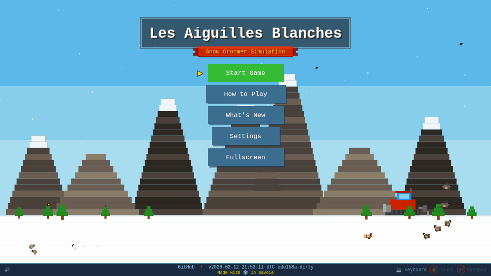
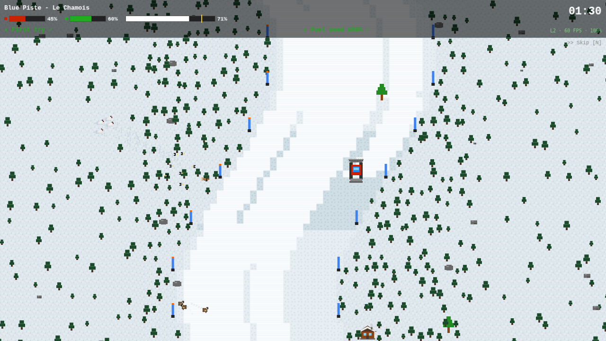
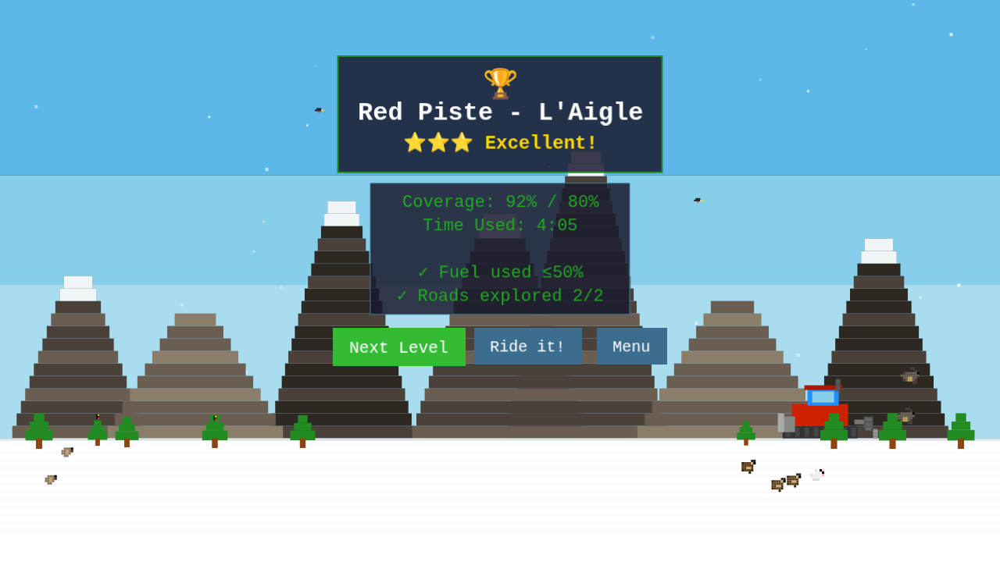
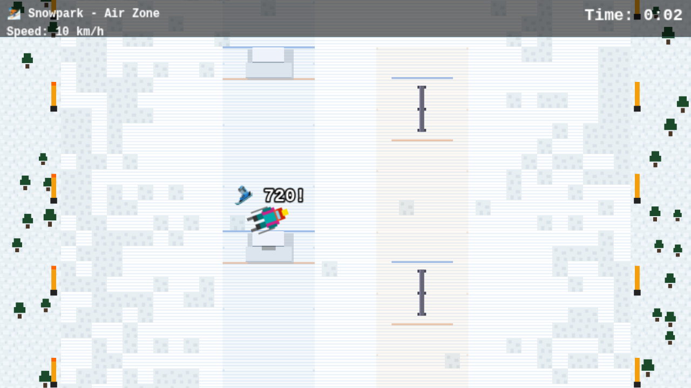

# Les Aiguilles Blanches — Snow Groomer Simulation

**[▶️ Play Online](https://cellerier.net/les-aiguilles-blanches/)** — No installation required!

<p align="center">
  
  
</p>
<p align="center">
  
  
</p>

A retro-style snow groomer simulation set in a fictional Savoie ski resort, inspired by the classic **SkiFree** aesthetic. You operate a PistenBully-style grooming machine across 11 progressive levels — from a gentle tutorial through night operations, storm recovery, and FIS competition prep.

## 🤖 Built with Copilot

This game is an experiment in building a complete, polished game almost entirely through conversation with **GitHub Copilot CLI**. From game design and pixel art to physics, audio, localization, and testing — the vast majority of the code, assets, and documentation were generated through iterative AI pair-programming sessions.

## ✨ Features

- **11 Progressive Levels** — Tutorial through storm operations, night grooming, and competition prep
- **Authentic Grooming** — Tiller with quality system, blade, winch with breakable cable
- **Terrain Park** — Kickers, rails, and halfpipe with zone-specific grooming challenges
- **Ski & Snowboard Reward Run** — Carve down your freshly groomed pistes with tricks, off-piste powder, and ski tracks
- **Savoyard Culture** — Tartiflette, fondue, and génépi that affect gameplay
- **Procedural Audio** — Chopin-style piano, engine sounds, weather, and Celeste-style voice — all Web Audio API
- **14 Languages** — 🇫🇷 🇬🇧 🇩🇪 🇮🇹 🇪🇸 🇸🇪 🇳🇴 🇫🇮 🇨🇿 🇵🇱 🇹🇷 🇸🇰 🇯🇵 🇰🇷
- **Full Accessibility** — High contrast, colorblind modes, rebindable controls, screen reader support
- **Multi-Platform Input** — Keyboard, mouse, gamepad (Xbox/PS/Nintendo), and touch

## 🚀 Quick Start

```bash
./setup.sh           # Install dependencies + Playwright browsers
./dev.sh             # Start dev server (reuses existing if running)
npm run clean        # Remove all build artifacts and caches
```

### 🖥️ Desktop Build (Optional)

```bash
./build-desktop.sh              # Build game + launch in Electron
./build-desktop.sh --pack       # Package for Linux (AppImage)
./build-desktop.sh --pack-win   # Package for Windows (installer + portable)
./build-desktop.sh --pack-mac   # Package for macOS (zip)
./build-desktop.sh --pack-all   # Package for all platforms
```

## 🧪 Testing

```bash
./run-tests.sh --browser chromium # Unit + E2E tests (Playwright)
./run-tests.sh --smart            # Only tests affected by uncommitted changes
```

See [docs/TESTING.md](docs/TESTING.md) for setup, helpers, and debugging.

## 📖 Documentation

| Doc | Covers |
|-----|--------|
| [GAMEPLAY.md](docs/GAMEPLAY.md) | Controls, level guide, objectives, tips |
| [ARCHITECTURE.md](docs/ARCHITECTURE.md) | Project structure, systems, patterns |
| [GAME_DESIGN.md](docs/GAME_DESIGN.md) | Design pillars, difficulty curve, food economy |
| [ART_STYLE.md](docs/ART_STYLE.md) | Visual style, palettes, sprite specs |
| [TESTING.md](docs/TESTING.md) | Test helpers, smart selection, debugging |
| [ROADMAP.md](docs/ROADMAP.md) | Work queue, backlog, tech debt |

## 📜 License

MIT License — Feel free to modify and share!

## 🧀 Credits

Inspired by the classic SkiFree game and the beautiful ski resorts of Savoie, France.

*Bonne glisse!* 🎿
